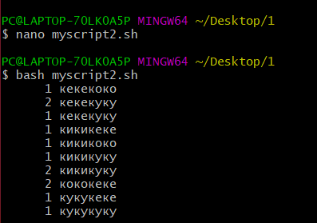
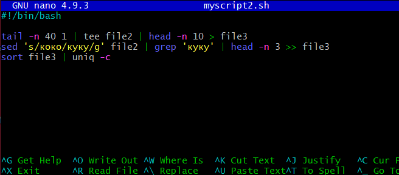

# Задание

Имеется многострочный файл - file1, в котором есть повторяющиеся строки (1000 строк). Необходимо выполнить следующую последовательность:
1. Выбрать из file1 40 последних строк и записать в file2.
2. Записать первые 10 строк из file2 в file3.
3. Выбрать в file2 все строки которые содержат "коко", заменить строку "коко" на "куку" и дописать только первые три вхождения в file3.
4. Оставить только уникальные строки в file3 и получить количества каждой уникальной строки в виде: КОЛ-ВО СТРОКА.

# Выполнение задания

## Вывод скрипта

